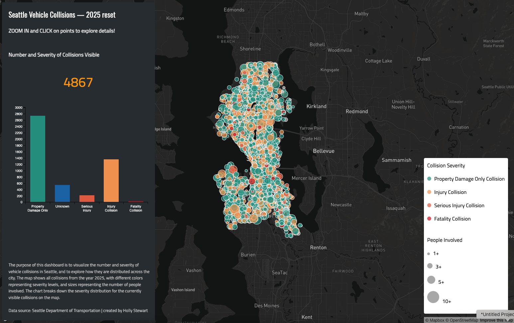

### Lab 6 Smart Dashboard  
# Seattle Vehicle Collisions in 2025  

## Project Overview  
  This Smart Dashboard visualizes car crashes across Seatlle for the year 2025 (January 1st-December 31st). Each collision is represented by a proportional symbol. The radius/size of the circle is determined by the number of people involved in the accident and the colour represents the severity by level of injury. By clicking on a point you can see this information as well as the date and time of the accident. On the left side, a bar chart also visualizes this information and by selecting one of the bars, only the symbols in that category will become visible on the map.   
  I chose this data and topic because my group (16) is working on a Seattle Collisions map for our final project. I wanted to experiment with visualizations and data, as well as practice the necessary code. I found that this dataset may be useful for our project as it has severity levels and person counts, both great pieces of information for our topic. Unfortunately, it also doesn't have geometry, so I had to use the longitude and latitude fields (which were flipped and needed to be edited) to locate each point.  
  
  The vehicle collision data is credited to _Seattle's Department of Transportation_ (SDOT) and the basemap is from _Mapbox_. 

## Map Link  
<a href="http://127.0.0.1:5501/">Seattle Collisions Map</a>  

## Map Image  
  

## Data Sources  
* Basemap: <a href="https://www.mapbox.com/">Mapbox</a>
* Seattle 2025 Vehicle Collisions Data: <a href="https://home.urbanlogiq.us/public/sdot-crash-analysis?c=47.62882415922627%2C-122.33633383229983&z=11.475429629025463">Seattle Department of Transportation</a>

  
